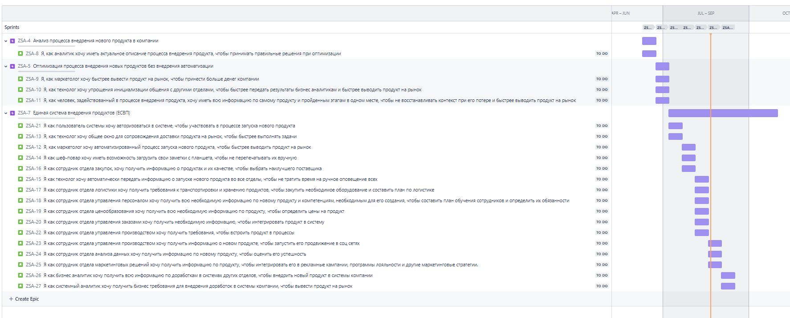
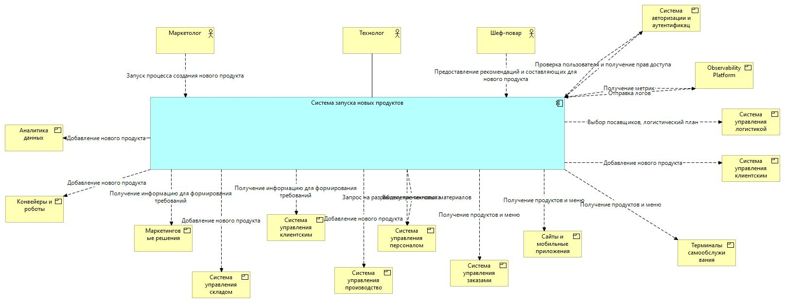

= Проект по разработке системы внедрения новых продуктов в сети столовых "Замысловатость"

== Общая информация
Проект направлен на создание и внедрение процесса внедрение новых продуктов в сети закусочных "Замысловатость". В рамках проекта будет:

- Проанализован и упрощен процесс внедрения новых продуктов. 

- Создана Единая система управления продуктами.

== Цели внедрения проекта
Цели проекта следующие:

- Ускорение внедрения новых продуктов в сети закусочнх.

- Повышение эффективности работы сотрудников путем реинжиниринга и автоматизации процессов.

== Описание проекта
Проект включает в себя следующие ключевые задачи:

- Оптимизация существующего процесса внедрения новых продуктов.

- Разработка и внедрение системы, учитывающей бизнес-процессы компании и специфические требования для работы в сети закусочных.

Использование методологии Scrum для организации процессов разработки и внедрения. Этот выбор обусловлен следующими причинами:

- Более высокий уровень опыта и понимания работы в Scrum, что позволит быстрее и безошибочно внедрить проект.

- Высокая степень неопределенности в проекте, которая лучше управляется через итеративные процессы Scrum.

- Необходимость быстрого внедрения полезного инкремента и получения обратной связи.

Управление проектом будет осуществляться в системе Jira, доступ к которой можно получить по [ссылке](https://alexussaha.atlassian.net/jira/software/projects/ZSA/boards/2).

== Roadmap проекта

[Cсылка](https://alexussaha.atlassian.net/jira/software/projects/ZSA/boards/2/timeline).

== Команда проекта
.Команда проекта
[cols="2*", options="header"]
|===
|Должность | Количество
|Team Lead системных аналитиков | 1
|Системный аналитик | 3
|BE Разработчик | 3
|FE Разработчик | 2
|Тестировщик | 1
|Продуктовый дизайнер | 1
|===

== Риски проекта
В данном разделе проводится анализ возможных рисков и предлагаются меры по их минимизации.

- **Нарушение целостности данных и проблемы с синхронизацией информации**  
  * **Источник риска:** Наличие разнородных систем, удаленность серверов в закусочных от центрального сервера, поэтапное внедрение системы в использование.  
  * **Последствия:** Потеря данных, разные данные на разных серверах, разочарование в системе.  
  * **Барьер:** Грамотно спроектированная архитектура, учет удаленности и задержек в нефункциональных требованиях (НФТ), проектирование системы с учетом НФТ, единое пространство для добавления данных.  
  * **Мера восстановления:** Поиск места, откуда данные можно восстановить, ручная синхронизация данных, внутренний PR, открытость процесса разработки, вовлечение всех заинтересованных в процесс.

- **Ошибки в программном коде и баги в приложении**  
  * **Источник риска:** Написание кода, некачественное тестирование, недостаточная документация.  
  * **Последствия:** Затягивание сроков завершения проекта, разочарование в системе, падение заинтересованности в проекте у команды.  
  * **Барьер:** До начала разработки писать тест кейсы, автоматическое тестирование, ревью документации со стороны тестирования и разработки.  
  * **Мера восстановления:** Исправление критичных багов, мотивация команды, внутренний PR, открытость процесса разработки, вовлечение всех заинтересованных в процесс.

- **Проблемы с обучением и поддержкой пользователей при переходе на новую систему**  
  * **Источник риска:** Неготовность пользователей принять новые процессы, сложность системы для пользователей, невозможность найти специалиста поддержки на рынке.  
  * **Последствия:** Длительный переход пользователей на платформу, саботаж перехода, снижение скорости выведения продукта на рынок.  
  * **Барьер:** Вовлечение пользователей в формирование требований, открытость процесса разработки, тестирование гипотез на фокус-группах.  
  * **Мера восстановления:** Работа с возражениями, тесное общение с руководителями отделов, сбор обратной связи по обучению и исправление обучающих материалов.

- **Сложности в адаптации пользователей к новому интерфейсу и функционалу**  
  * **Источник риска:** Низкая прозрачность процессов, высокая сложность интерфейса, неготовность пользователей отойти от старого процесса.  
  * **Последствия:** Отказ пользователей от использования системы, недовольство пользователей, снижение скорости вывода продуктов на рынок.  
  * **Барьер:** Тесная работа с пользователями, тестирование новых функций на фокус-группах, постоянный сбор обратной связи и ее обработка.  
  * **Мера восстановления:** Исправление и повышение удобства интерфейса, тесное общение с руководителями отделов, более интенсивное обучение пользователей.

- **Проблемы с удобством и эргономикой пользовательского интерфейса**  
  * **Источник риска:** Поверхностная проработка UX, отсутствие обратной связи от пользователей, отсутствие опыта работы с подобной системой.  
  * **Последствия:** Недовольство пользователей, отсутствие обратной связи на развитие продукта, сокращение скорости выведения продуктов на рынок.  
  * **Барьер:** Привлечение опытного дизайнера и свобода действий, тестирование новых функций на фокус-группах, постоянный сбор обратной связи и ее обработка.  
  * **Мера восстановления:** Исправление и повышение удобства интерфейса, активный саппорт пользователей, более интенсивное обучение пользователей.

- **Ограниченные возможности расширения функциональности выбранной технологии**  
  * **Источник риска:** Лицензионные ограничения, технология, недоступная для модификации, отсутствие специалистов, способных написать плагин.  
  * **Последствия:** Затягивание сроков завершения проекта, снижение качества продукта, высокие затраты на поддержку.  
  * **Барьер:** Внимательное изучение лицензии выбранной технологии, изучение возможности расширения технологии, проверка наличия экспертов по технологии в команде, при необходимости привлечение специалистов на рынке.  
  * **Мера восстановления:** Изучение технологии, замена технологии на более подходящую, написание надстройки над технологией.

== Описание выбранного решения
Решение включает два этапа:

1. Реинжиниринг существующих процессов:

- Выявление слабых мест процесса

- Оптимизация процесса.

2. Внедрение системы, которая обеспечивает следующие возможности:

- Единый флоу для внедрения новых продуктов.

- Единое место подключения необходимых специалистов и передачи им информации по новому продукту.

- Автоматическое распространение информации о новом продукте по всем имеющимся системам в компании.

== Описание архитектуры с НФТ

.Архитектура системы

Архитектура системы представлена в файле:
[Архитектура](diagrams/SA_TL_ARCH.archimate)

.Краткое описание

Система будет спроектирована с учетом следующих нефункциональных требований:

.Нефункциональные требования
[options="header"]
|===
|Требование | Атрибут
|Доступность | Система должна демонстрировать уровень доступности, при котором время простоя в работе системы не ниже 99%
|Производительность | 95% запросов должны обрабатываться менее чем за 3 секунды. Количество запросов 
10000 в день (min)
55000 (avg)
110000 (max)
в период 1 день
|Производительность | Система должна поддерживать одновременную работу  в интерфейсе не менее 10 пользователей
|Производительность | Время обновления меню не более 5 минут при запуске продукта
|Надежность | Время восстановления системы после сбоя не должно превышать 30 минут.
|Надежность |Стабильная работа интеграций
|Надежность |Гарантированное обновление всех терминалов и систем.
|Особенности хранения | Хранение картинок в формате JPEG, PNG, SVG
|Особенности хранения| Система должна хранить неструктурированные данные
|Удобство использования | Система должна поддерживать работу не менее 10 пользователей одновременно.
|Удобство использования  | Система должна распознавать данные в записке и переводить их в текст
|Удобство использования  |Система должна автоматически подключать необходимых людей к внедрению продукта
|Безопасность | Данные должны быть защищены при передаче и хранении.
|Безопасность | Работа во внутренней сети закусочной
|Безопасность | Авторизация и аутентификация
|===

.Приоритеты

Производительность: Высокий приоритет, так как конкуренты внедряют новые продукты быстрее.

Удобство использования: Важно для повышения эффективности работы сотрудников.

Масштабируемость: Необходимо для поддержания роста и расширения сети закусочных.

Безопасность: Важна для сохранения доверия клиентов и защиты данных.

== Интеграция с существующими системами

* Аналитика данных
* Конвейеры и роботы
* Маркетинговые решения
* Система управления складом
* Система управления клиентским опытом
* Состема управления производством
* Система управления персоналом
* Система управления заказами
* Сайты и мобильные приложения
* Терминалы самообслуживания
* Система управления клиентами
* Система управления логистикой
* Observability platform
* Система авторизации и аутентификации

== Заключение
Реализация этого проекта позволит существенно сократить время на внедрение новых продуктов, что повысит уровень лояльности клиентов и конкурентоспособность сети столовых "Замысловатость", что в конечном итоге приведет к увеличению выручки компании.